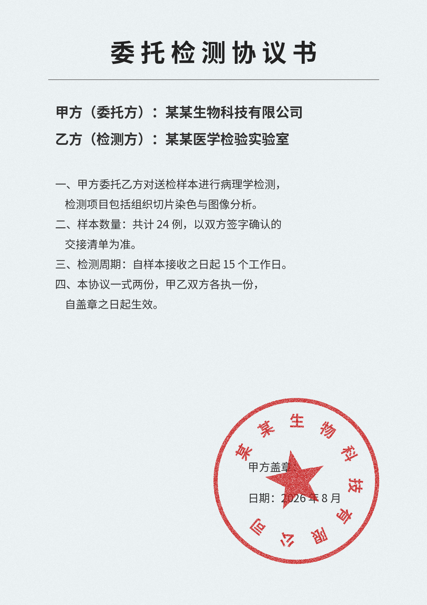
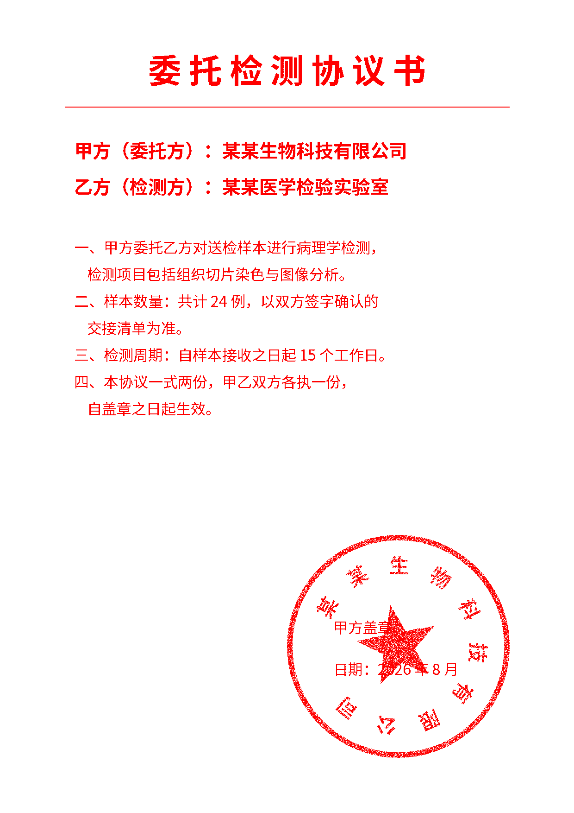
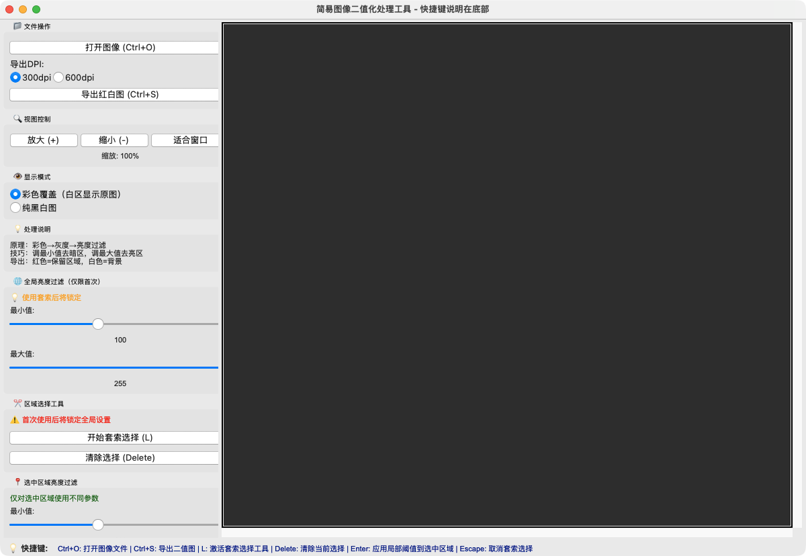
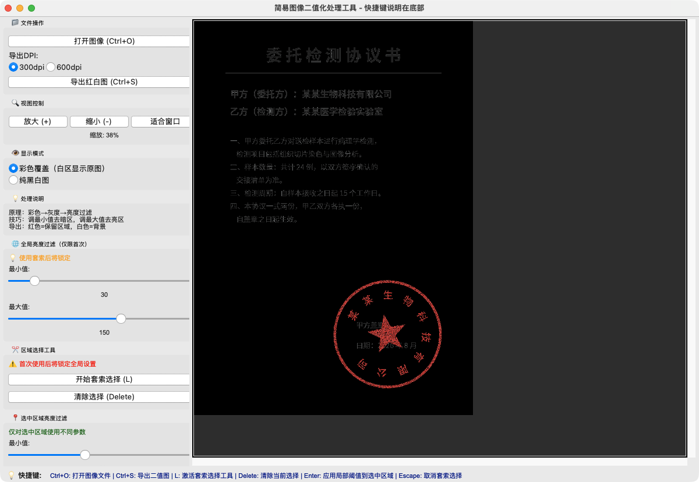
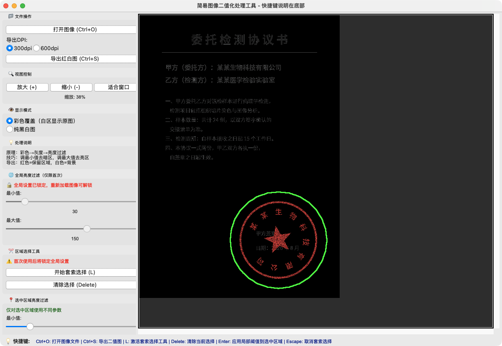
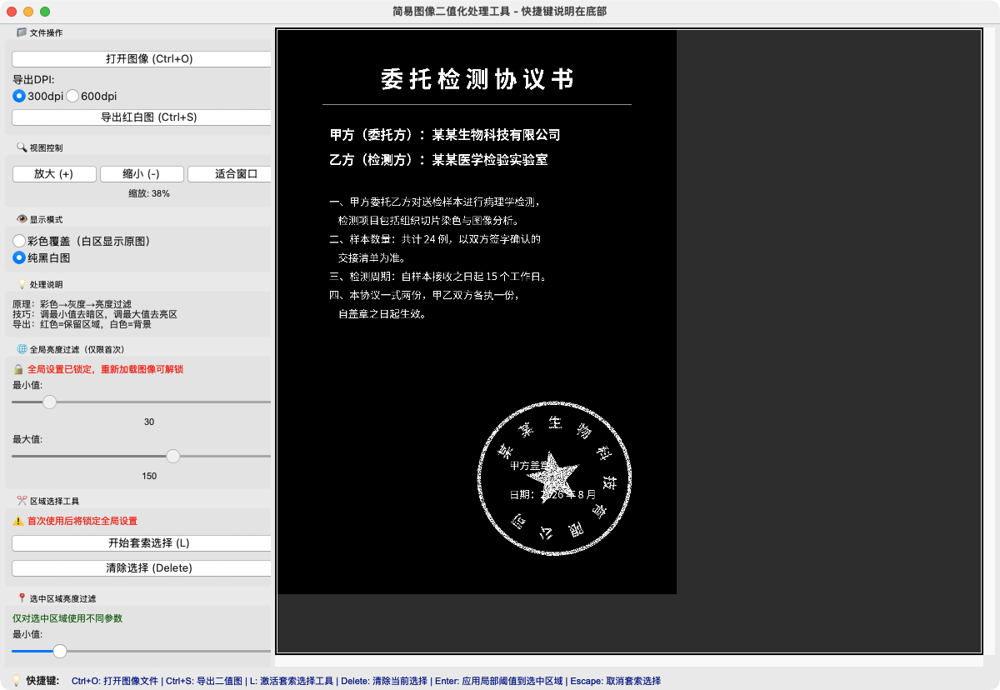

# 印模提取工具（Seal Impression Extractor）

一个简单实用的桌面小工具：把扫描件 / 照片上的**印章、手写签字、深色字迹**从背景纸上分离出来，导出为「红白图」（红色 = 保留区域，白色 = 背景），可自选 300 / 600 dpi A4 输出，方便排版打印回纸质文件。

原理一句话：**彩色 → 灰度 → 亮度范围过滤**。支持全图过滤 + 套索圈选局部精修，全程实时预览。

> A simple cross-platform desktop tool that extracts seal impressions / stamps / dark handwriting from scanned documents via grayscale range thresholding, with lasso-based local refinement, and exports red-on-white images at 300/600 dpi (A4).

---

## 📥 下载安装

到 [**Releases**](../../releases) 页面下载对应平台：

| 平台 | 文件 | 说明 |
|---|---|---|
| Windows | `SealImpressionTool-windows-x64.exe` | 单文件，双击即用 |
| macOS | `SealImpressionTool-macos.zip` | 解压得到 `.app`，拖入「应用程序」 |

**macOS 首次打开提示"无法验证开发者"时**（未签名的开源软件都会这样）：

```bash
xattr -dr com.apple.quarantine /Applications/SealImpressionTool.app
```

或在「访达」中**右键 → 打开**，弹窗里再点「打开」即可。

---

## 🖼️ 效果预览

| 原始扫描件 | 提取结果（红白图） |
|---|---|
|  |  |

---

## 📖 使用教程

### 第 1 步：打开图像

启动后点击左上角 **「打开图像 (Ctrl+O)」**，支持 jpg / png / bmp / tiff。



### 第 2 步：全局亮度过滤

拖动 **「🌐 全局亮度过滤」** 的最小值 / 最大值滑杆：

- 灰度值落在 `[最小值, 最大值]` 区间内的像素会被**保留**（彩色覆盖模式下显示原图内容，其余变黑）
- 纸张背景通常很亮（接近 255），印章印泥偏暗——**把最大值拉低**即可滤掉背景
- 底部状态栏实时显示保留区域的占比

> ⚠️ 全局过滤**只在首次有效**：一旦使用套索，全局参数即锁定（防止误改），重新加载图像可解锁。



### 第 3 步：套索圈选，局部精修

全局过滤后若某些区域不干净（比如印章盖在文字上）：

1. 点击 **「开始套索选择 (L)」**，按住鼠标左键圈出要精修的区域，松手完成
2. 区域出现**绿色描边**，表示进入预览状态
3. 拖动 **「📍 选中区域亮度过滤」** 滑杆，**只有圈内**应用新参数，实时预览
4. 按 **回车 (Enter)** 应用；按 Esc 取消，按 Delete 清除重选



### 第 4 步：检查黑白效果

把显示模式切到 **「纯黑白图」**，确认最终保留区域（白色 = 保留）。



### 第 5 步：导出红白图

点击 **「导出红白图 (Ctrl+S)」**：

- **红色 = 保留区域，白色 = 背景**
- 可选 **300dpi（2480×3508）** 或 **600dpi（4960×7016）** 的 A4 画布，图像自动居中
- 导出后直接用 Word / 打印排版即可

### 视图操作

| 操作 | 方式 |
|---|---|
| 缩放 | 鼠标滚轮，或 `+` / `-` 键，或左侧按钮 |
| 平移 | 按住 **空格** + 鼠标拖拽 |
| 适合窗口 | `Ctrl+0` 或「适合窗口」按钮 |

### 快捷键一览

| 快捷键 | 功能 |
|---|---|
| `Ctrl+O` | 打开图像文件 |
| `Ctrl+S` | 导出二值图 |
| `L` | 激活套索选择工具 |
| `Delete` | 清除当前选择 |
| `Enter` | 应用局部阈值到选中区域 |
| `Escape` | 取消套索选择 |
| `+` / `=` | 放大图像 |
| `-` | 缩小图像 |
| `Ctrl+0` | 适合窗口大小 |
| `Space+拖拽` | 平移图像 |

---

## 🛠️ 从源码运行

```bash
git clone https://github.com/UnstoppableCurry/seal-impression-tool.git
cd seal-impression-tool
pip install -r requirements.txt
python main.py
```

依赖：`opencv-python`、`numpy`、`pillow`（tkinter 为 Python 自带）。

## 📦 自行打包

```bash
pip install pyinstaller

# Windows（生成单个 exe）
pyinstaller --onefile --windowed --name SealImpressionTool main.py

# macOS（生成 .app）
pyinstaller --windowed --name SealImpressionTool main.py
```

产物在 `dist/` 目录。仓库的 GitHub Actions 已配置自动构建双端安装包，打 `v*` 标签即触发并发布 Release。

## 背景

本项目最初只有一个打包好的 Windows 可执行文件，源码遗失。当前代码是从该 exe（PyInstaller / Python 3.8）完整反编译还原、人工修复并经功能验证的版本，另修复了原程序在 macOS 上文件选择对话框无法选中图片的兼容性问题。现以 MIT 协议开源，欢迎使用与改进。

## License

[MIT](LICENSE) © 2026 UnstoppableCurry
